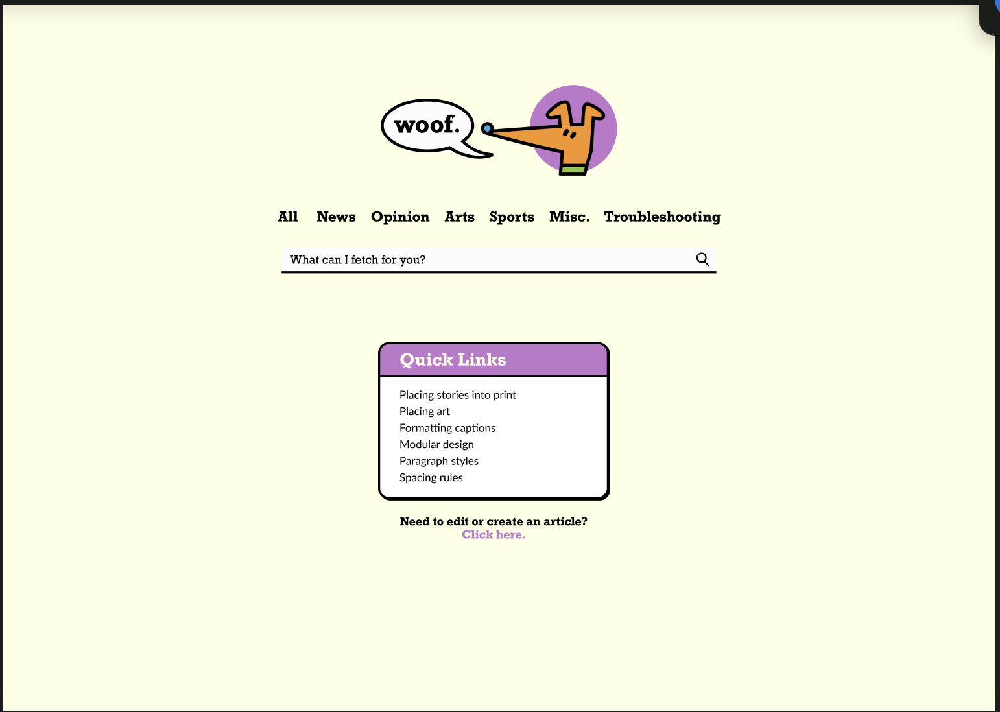
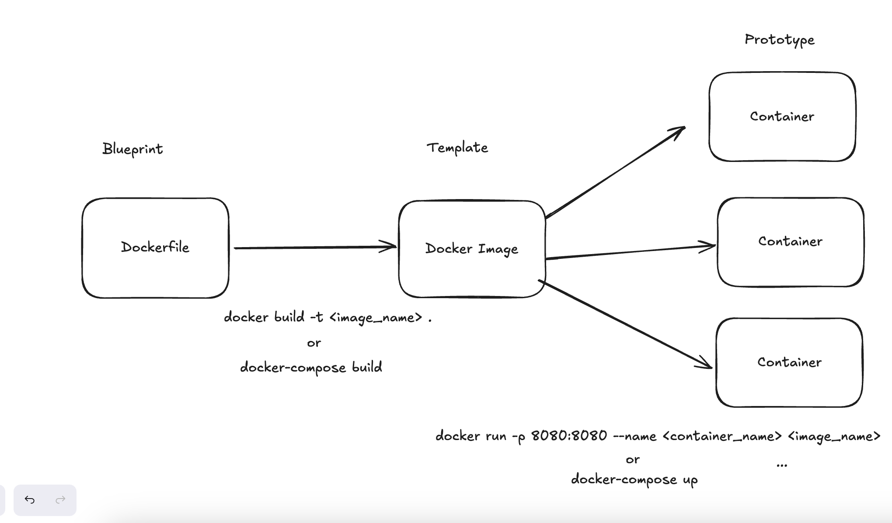
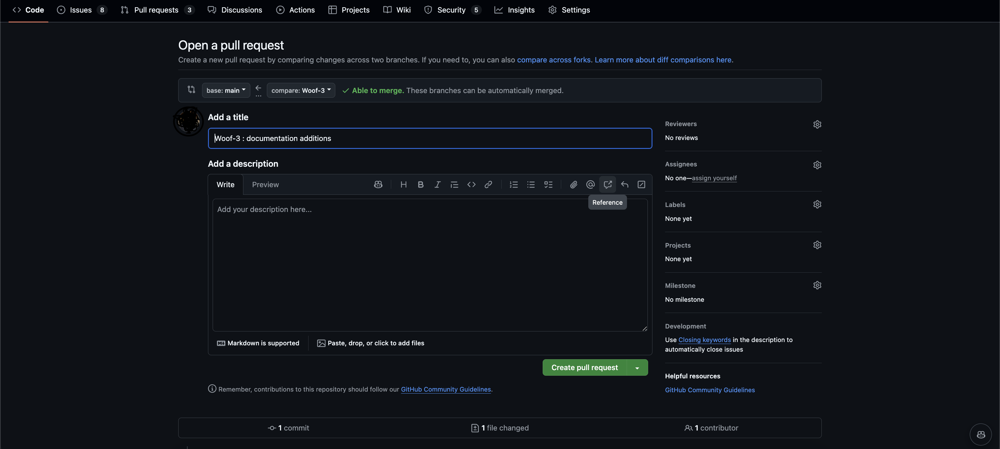

# Woof 
Woof is a website that contains style guides and information about how to design each element of the Daily Bruin newspaper. It will be used by the Design section to teach new designers how to design the paper and keep designs consistent over time.

## Daily Bruin Design


Visit the <a href="https://www.figma.com/design/bQuRZ1C2EDqgNmCYui8iqE/woof?node-id=0-1&node-type=canvas">Figma</a> to see more about the Design of Woof. 
To see the requirements guide, visit <a href="https://docs.google.com/document/d/1S7moCvya6fsls2iWeL_YoR239hYyv1JbMTDSRk3CNsk/edit?tab=t.0">doc</a>.

## Technology Stack

**Frontend:**
 


**Backend:**
 
 


## How do I install Woof?
To install woof onto your local machine. 
1. Clone the Repository
```
git clone https://github.com/dailybruin/woof.git
```
2. Go into the /woof directory
```
cd woof
```
3. Install all dependencies
```
npm install 
```
4. Configure your `.env` file
```
EMAIL_DOMAIN=
GOOGLE_CLIENT_ID=
GOOGLE_CLIENT_SECRET=
NEXTAUTH_SECRET=
NEXTAUTH_URL=http://localhost:3000
```

## File Structure 
```
woof/
├── .vscode/
│   └── extensions.json
├── components/
│   ├── ArticleList.tsx
│   ├── ArticleSectionDisplay.tsx
│   ├── Box.tsx
│   ├── ChangeArticle.tsx
│   ├── Form.tsx
│   ├── NavBar.tsx
│   ├── PinnedArticles.tsx
│   ├── Quicklink.tsx
│   └── SearchBar.tsx
├── lib/
├── models/
│   ├── article.ts
│   └── Pet.ts
├── node_modules/
├── pages/
│   ├── [id]/
│   │   ├── edit.tsx
│   │   └── index.tsx
│   ├── api/
│   │   ├── articles/
│   │   ├── auth/
│   │   └── pets/
│   ├── _app.tsx
│   ├── _document.tsx
│   ├── all.tsx
│   ├── arts.tsx
│   ├── index.tsx
│   ├── misc.tsx
│   ├── new.tsx
│   ├── news.tsx
│   ├── opinion.tsx
│   ├── sports.tsx
│   └── troubleshooting.tsx
├── public/
├── styles/
├── types/
│   └── next-auth.d.ts
├── .env
├── .gitignore
└── .prettierignore
```

## Docker 
We use docker for two reasons. First reason is to allow for development irrespective of a developers operating system. Second reason is for ease of development. Developers only need to run two simple commands to be able to immediately start developing on Woof.



### Docker Volume-Mounted 
1. Run the command `docker-compose build` 
- This command builds the image (install all necessary node versions and packages), port forwards it (3000), and volume mounts it (usr/src/app).
2. Run the command `docker-compose up`
- This command builds the containers based of the image created and actually runs our process. 
3. Open `http://localhost:3000`


### Docker Manual 

1. Run the command: `docker build -t woof .`
This command builds a docker image based on the dockerfile in the root directory with a tag called woof 
- docker does need the docker daemon (host) running. This is required by docker in order to create containers from the image template that was just built. Often, the docker daemon is the docker desktop app. 

2. Next run: `docker run --name woof_contain -p 3000:3000 woof:latest`
- runs a docker container based on the image we just created with the previous `docker build` command. 
- the -d tag runs the container in detached mode (container runs in the background, allowing you to still use the terminal)
- the -p option maps the port 3000 on the docker host to port 3000 on the container. 
- `woof:latest` is the name of the docker image to use for the container, latest specifies the latest version of the image. 
- `--name woof_contain` is to name the container woof_contain
- to build up a new container 

3. stopping the container from running `docker stop <container_name>` 

4. Optionally* to start an existing container run: `docker start <container_name>`

## How do I contribute?
If you'd like to contribute:
1. Create a branch, to standardize branch naming conventions; branches are usually named after the ticket number assigned to it.
```
git checkout -b <Ticket_Number>
```
2. Develop on the branch, stage, commit, and push the code to the branch
```
git add .
git commit -m "<Ticket_Number> : <commit message">
git push
```
*The first push will require a push upstream 
```git push --set-upstream origin <branch_name>```


3. Make a Pull Request (PR) on GitHub, usually you will need to visit the exact branch in GitHub and then creating a PR. 

Hit Create Pull Request. Then await for approval from an administrator.

4. Once approved, your changes will be merged and you've made a contribution into production!


# Default Documentation
You don't need to read the documentation below to develop the application. It is kept just in-case someone needs a reference point to the original documentation. This project is built off of this <a href="https://github.com/vercel/mongodb-starter">mongodb-nextjs template</a>.

## Configuration

### Step 1. Get the connection string of your MongoDB server

In the case of MongoDB Atlas, it should be a string like this:

```
mongodb+srv://<username>:<password>@my-project-abc123.mongodb.net/test?retryWrites=true&w=majority
```

For more details, follow this [MongoDB Guide](https://docs.mongodb.com/guides/server/drivers/) on how to connect to MongoDB.

### Step 2. Set up environment variables

Copy the `.env.local.example` file in this directory to `.env.local` (which will be ignored by Git):

```bash
cp .env.local.example .env.local
```

Then set each variable on `.env.local`:

- `MONGODB_URI` should be the MongoDB connection string you got from step 1.

### Step 3. Run Next.js in development mode

```bash
npm install
npm run dev
```

Your app should be up and running on [http://localhost:3000](http://localhost:3000)! If it doesn't work, post on [GitHub discussions](https://github.com/vercel/next.js/discussions).


#### Deploy Your Local Project

To deploy your local project to Vercel, push it to GitHub/GitLab/Bitbucket and [import to Vercel](https://vercel.com/import/git?utm_source=github&utm_medium=readme&utm_campaign=next-example).

**Important**: When you import your project on Vercel, make sure to click on **Environment Variables** and set them to match your `.env.local` file.


